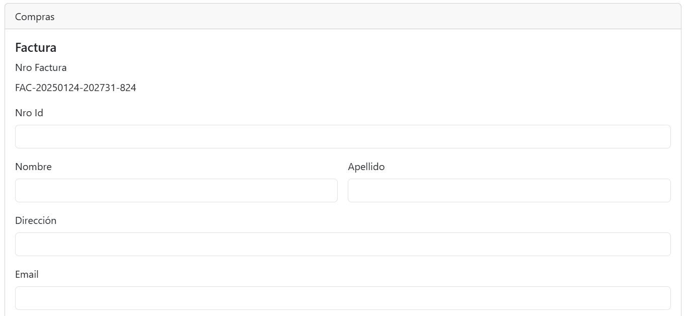
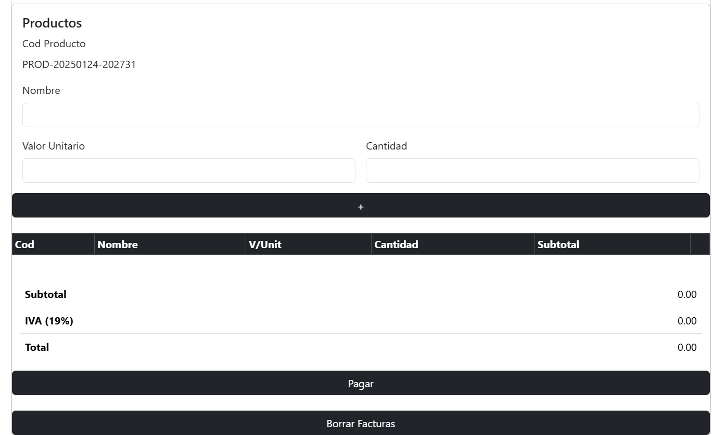

# Factura electrónica-Actividad
https://merliariza.github.io/factura-actividad-js/
Esta acividad consiste en una aplicación web interactiva para manejar la creación de facturas. Utiliza web components y una base de almacenamiento por medio de objetos literales.
## Descripción
El usuario puede ingresar sus datos personales y los productos a comprar, los cuales, se almacenaran en una tabla, logrando así una mejor comprensión de la compra, para finalmente, luego de haber llenado el formulario al dar click al botón para pagar, se limpiará la información y se almacenará de manera automática en objetos literales.

### Características principales
- **Creación y almacenamiento de facturas**: Al dar click al botón para pagar las facturas son almacenadas con los datos que llenó el usuario.
- **Trabajo con web components**: Los formularios son creados con el uso de web components facilitando así la comprensión del código.
- **Diseño responsivo**: La aplicación está diseñada para ser completamente funcional en dispositivos de diferentes tamaños.
## Tecnologías utilizadas
- **JavaScript**: Para la funcionalidad dinámica, asincrónica y manejo de eventos.
- **Web Components**: Para la creación de etiquetas HTML totalmente personalizadas, reutilizables y encapsuladas.
- **HTML & CSS**: Para la estructura y estilo de la aplicación, con un enfoque en la adaptabilidad y la experiencia de usuario.